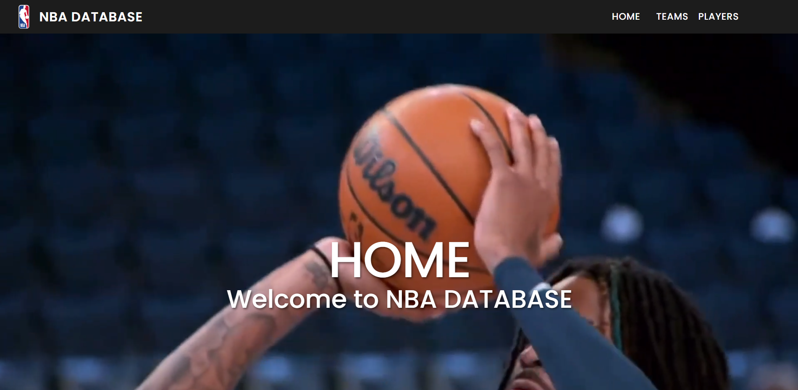

# NBA Site

This is a web application that provides NBA fans with information on all teams and players currently in the league. The app provides a user-friendly interface that is easy to navigate.

Features:
- View all current NBA teams and their basic information
- View all current NBA players and their basic information
- Search for teams or players by name
- Sort teams or players by various categories, such as conference or position
- Learn more about the NBA and its history through informative articles and resources

The app is built with React and Material UI for the frontend, and uses the NBA API to fetch data. The app is deployed on GitHub Pages and can be accessed at [https://your-username.github.io/nba-site](https://your-username.github.io/nba-site).

This project is an ongoing effort and we welcome contributions from the community. Please see the CONTRIBUTING.md file for more information on how to contribute.

Thank you for checking out our NBA Site!

Here are screenshots of the currents site: 

